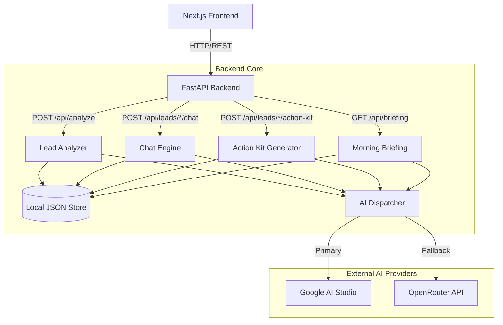

# AI Lead Prioritizer

This project is an AI-powered lead scoring, ranking, and action planning tool built for real-estate sales teams. It was created as an assignment for the Masal AI interview process.

The goal is simple: instead of manually reading and guessing which leads to call first, a salesperson inputs the customer inquiry and gets an instant 0-100 score, a priority tier, and actionable scripts to close the deal.

🔗 **Live App:** [masal-ai-project.vercel.app](https://masal-ai-project.vercel.app/)  
📹 **Demo Video:** [Demo Video](https://drive.google.com/file/d/1sjcdIcWFwjQN5wGPEo4i06v-2f5DYV-P/view?usp=sharing)

## What I Built

A real-estate sales team receives hundreds of leads a day. This application helps a salesperson prioritize who to call first and gives them the exact words to say.

1. **Intake:** The user pastes a customer's message and adds basic details like budget, timeline, and location.
2. **AI Analysis:** The backend analyzes the inquiry, extracts key requirements and objections, and assigns a 0-100 urgency score and a priority tier (HOT, WARM, or COLD).
3. **Action & Follow-up:** With one click, the salesperson gets a call script, a WhatsApp message, and a follow-up task.

## Architecture Overview

Here is how the different features and services connect:



## Features

1. **Intake Form and Prioritized Dashboard:** A two-column layout where you can add leads on the left and see them instantly ranked on the right.
2. **AI Analysis & Scoring:** Every lead is broken down into a summary, intent, extracted requirements, and objections. It receives a 0-100 score based on urgency.
3. **Filter and Search:** Quickly filter leads by their tier (HOT, WARM, COLD) or search by name and location.
4. **Action Kit (Custom Added Feature):** A single button that generates everything needed before, during, and after a call:
   * A 5-line call talk-track.
   * A personalized WhatsApp draft.
   * An AI-calculated follow-up task and due date.
5. **WhatsApp Connect:** If a phone number is provided, the Action Kit generates a "Send via WhatsApp" button that opens the WhatsApp app with the drafted message pre-filled.
6. **Morning Briefing:** A button on the dashboard that generates a bulleted AI briefing outlining exactly who to call first today, what to say, and red flags to watch out for.
7. **Grounded Chat:** A chat interface on the lead detail page. The AI acts as a sales coach and answers questions strictly using that specific lead's data.
8. **Tier-Reactive UI:** The lead detail page dynamically changes its background colors and animated effects based on the lead's tier. Hot leads get a pulsing red background, warm leads get a breathing amber effect, and cold leads have a calm blue drift.
9. **Lead Lifecycle:** You can close a lead with a comment. Closed leads turn grayscale and drop to the bottom of the dashboard. Reopening them triggers a fresh AI re-analysis using the closing comment as new context.

## Key Technical Decisions

* **Multi-Provider Fallback:** I built a custom dispatcher that tries Gemini first and automatically falls back to OpenRouter if the quota is hit or the API fails. This ensures the app doesn't break during a live demo if a free tier limit is reached. The user can also force a specific model from the dashboard dropdown.
* **Deterministic Guardrails:** The AI doesn't have the final say on the score. I implemented a scoring guardrail system in Python. If a customer says "ASAP", the score is automatically boosted to a minimum of 75 (HOT). If the message is just two words, the score is capped at 50. The AI provides the signal, but hardcoded logic enforces the business rules.
* **Pydantic Validation and Error Recovery:** LLMs can be unpredictable. Sometimes they return a list of strings instead of a single paragraph. Instead of letting the app crash, I used Pydantic field validators to catch these format drifts and correct them on the fly before they reach the frontend.
* **JSON File Persistence:** To survive server cold starts (like Render spinning down after 15 minutes of inactivity), the backend writes all state to a local `store.json` file. It's lightweight, requires no external database setup for reviewers, and keeps the demo running smoothly.

## AI Model & API Details

The application uses free-tier models exclusively.

* **Google AI Studio (Gemini):** `gemini-3.1-flash-lite` (used for fast analysis and chat) and `gemini-3.6-flash`.
* **OpenRouter:** `openrouter/auto`, `google/gemini-2.0-flash-exp:free`, and `meta-llama/llama-3.1-8b-instruct:free`.

The backend forces the AI into different personas depending on the endpoint:
* For analysis, it uses a strict JSON prompt with scoring weights.
* For chat, it acts as a concise sales coach restricted to the lead's context.
* For the briefing, it takes on the persona of a senior sales manager outputting bulleted markdown.

## How to Run Locally

### Backend Setup

1. Open a terminal in the `backend` folder.
2. Create and activate a virtual environment:
   ```bash
   python -m venv venv
   # Windows: venv\Scripts\activate
   # Mac/Linux: source venv/bin/activate
   ```
3. Install the requirements:
   ```bash
   pip install -r requirements.txt
   ```
4. Copy `.env.example` to `.env` and add your keys:
   ```
   GEMINI_API_KEY=your_google_key
   OPENROUTER_API_KEY=your_openrouter_key
   FRONTEND_URL=http://localhost:3000
   ```
5. Start the server:
   ```bash
   uvicorn main:app --reload --port 8000
   ```

### Frontend Setup

1. Open a terminal in the `frontend` folder.
2. Install the dependencies:
   ```bash
   npm install
   ```
3. Start the development server:
   ```bash
   npm run dev
   ```
4. Open `http://localhost:3000` in your browser.

## Known Limitations

* **Render Free Tier Cold Starts:** The backend is hosted on Render's free tier, which spins down after 15 minutes of inactivity. The very first request after being idle might take 30 to 50 seconds to wake the server up. The frontend displays a "Warming backend" indicator during this time.
* **Free-Tier API Quotas:** The Gemini API has a limit of around 20 requests per day on the free tier. Heavy testing might exhaust this quota, which is why the OpenRouter fallback was implemented.

## AI Usage Disclosure

I used the following AI tools to assist in building this project:
* **Claude Opus 4.6:** Used for architecture planning, feature design decisions, and deployment strategy.
* **Gemini 3.1 Pro:** Used to help generate code for specific features, UI components, and debugging.
* **Muse (OpenCode):** Used for the initial Next.js and FastAPI application scaffolding.

All generated code was manually reviewed, modified, and integrated by me to ensure it met the exact requirements of the assignment.
